# Crypto Multi-Market Quant Platform 思维导图

> 本图是 `PROJECT_PLAN.md` 的结构化导航。思维导图中的 `00` 至 `31` 节点与计划书同编号、同标题一一对应；本文件属于规划基线，不代表对应功能已经实现或通过运行验收。

## 主图

```mermaid
mindmap
  root((Crypto Multi-Market Quant Platform))
    00 项目边界与总原则
      独立数字资产系统
      Crypto Core 加双适配器
      Standalone 不依赖 GACE
      不改 A 股系统和 GACE Core
      观察优先与故障默认安全
      证据状态分离
    01 背景与问题定义
      A 股假设不能直接迁移
      多交易所品种和规则不一致
      最新价不等于可成交价
      双腿订单存在单腿风险
      历史 K 线不足以准确回测套利
      GACE 当前进度不能阻塞核心建设
    02 产品目标与成功标准
      P0 独立基线
      P1 多市场行情
      P2 历史数据与回放
      P3 价差扫描
      P4 回测与模拟
      P5 真实账户只读
      P6 受控现货候选
      P7 GACE 候选包
      P8 GACE 运行闭环
      可复现可审计可独立运行
    03 用户角色与核心流程
      研究用户
      策略用户
      模拟交易用户
      交易管理员
      GACE 用户
      GACE AI
      行情观察流程
      价差研究流程
      回测和模拟流程
      真实账户与 GACE 流程
    04 市场范围与接入策略
      第一阶段中心化交易所现货
      先接 2 到 3 个交易所
      BTC ETH SOL 等高流动性交易对
      统一品种和交易规则
      稳定币不是绝对一美元
      后置合约 DEX 跨链
      地区与合规边界
    05 总体架构原则
      双目标单内核
      Standalone Adapter
      GACE Adapter
      控制平面与执行平面分离
      端口与适配器
      可重放和可解释
      独立执行核心优先
    06 系统总体架构
      Web UI 与 API
      行情采集与标准化
      Venue Registry
      Instrument Registry
      Opportunity Engine
      Strategy Runtime
      Backtest 与 Replay
      Paper Trading
      Account 与 Execution
      Risk Task Notification
      PostgreSQL Redis Parquet
      第一阶段单体服务加 Worker
    07 功能模块设计
      行情中心
      市场与品种中心
      公开品种目录
      交易约束标准化
      缓存与网络阻断状态
      机会中心
      策略中心
      回测中心
      模拟交易中心
      账户与执行中心
      任务与通知中心
      策略孵化池与筛选联动
    08 领域模型与数据设计
      Venue
      Instrument
      MarketEvent
      OrderBook
      Opportunity
      Strategy
      Order Fill Position Ledger
      Account RiskEvent Task
      事件时间与接收时间
      Decimal 精度与舍入
      追加账本和对账
      数据库与 Secret 隔离
    09 行情采集与历史数据计划
      公开 REST 与 WebSocket
      品种发现与历史归档分离
      独立 market-worker 可选 profile
      L1 L2 成交数据
      快照增量和序列校验
      盘口重建与断线重连
      序列异常自动重新获取快照
      数据新鲜度和质量规则
      Worker 与 API 共享状态文件
      API 只读挂载与 Worker 读写挂载
      历史下载任务
      默认 Scheduler 定时增量同步
      Worker 默认消费历史任务
      活跃任务去重与失败退避
      Manifest 与数据指纹
      history-raw-response-v1 合同
      原始响应敏感字段白名单
      history_dataset_records 正式元数据
      CSV Manifest Raw DB 提交顺序
      元数据失败可协调
      Parquet 失败标记 DEGRADED
      Parquet 原始归档
      可恢复幂等回放
    10 策略模型与策略运行时
      价差策略
      资金费率与基差研究
      统计套利候选
      策略输出标准化信号
      信号不直接下单
      Backtest Paper Live 模式
      版本参数和来源记录
      插件不直接访问网络数据库
    11 跨市场价差与执行编排
      可成交买价与卖价
      双边手续费滑点延迟
      资金预置
      两腿执行状态机
      部分成交和单腿失败
      对冲人工接管和安全暂停
      机会过期与阻断
      第一阶段无杠杆现货
    12 回测、回放与模拟交易
      K 线回测
      组合回测与策略比较
      参数搜索与信号筛选
      L1 回放
      L2 盘口回放
      成本与延迟参数
      防止未来数据
      模拟撮合
      双腿成交与未对冲状态
      可重复结果报告
      模拟与实盘隔离
    13 账户、风险、安全与生命周期
      API Key 最小权限
      默认只读
      禁止提币
      资金与交易对白名单
      风险限额和熔断
      安全暂停
      GACE 停止不等于平仓
      对账后恢复
      真实交易人工确认
    14 独立运行模式
      独立前端 API Worker
      独立数据库 Redis 数据目录
      独立 Secret
      CRYPTO_BIND_ADDRESS 可配置
      Ubuntu 10.10.10.129 与 FRP
      Docker Compose 或本地服务
      不读 GACE 和 A 股数据
      可独立停止重启
      独立模式验收
    15 GACE App 兼容与构建中心计划
      GACE App 身份认证权限
      Secret Task Notification
      gace-app 适配目录
      web-service 或 multi-container-app
      控制台模式优先
      完整托管后置
      构建输入与制品摘要
      SBOM 签名许可证
      C1 到 C6 兼容分级
      GACE 合同变化风险
    16 GACE AI 能力接入计划
      声明式版本化 Action
      只读 Action
      受控写 Action
      高风险 Action 二次确认
      回测和扫描异步任务
      AI 不直达密钥和数据库
      Notification Outbox
      机会风险和对账通知
    17 现有量化系统的复用与禁止复用
      借鉴策略插件边界
      借鉴信号标准化
      借鉴数据 Manifest
      借鉴任务幂等恢复
      借鉴风险控制和资源管理
      禁止复用 A 股手续费规则
      禁止复用 T 加 1 涨跌停一手
      禁止复用 A 股数据和账户模型
      读取源码和测试后再抽象
    18 非功能要求与运行管理
      Decimal 和事件一致性
      断线重连和可用性
      延迟与吞吐可观测
      指标日志和脱敏
      订单未知状态
      备份策略账本审计
      真实状态恢复需重新对账
    19 测试与验收证据
      单元和合同测试
      Fake Exchange
      录制回放
      断线限频拒单部分成交
      安全与 Secret 泄露测试
      浏览器与 GACE 测试
      G0 到 G9 验收门
      Commit 制品日志后验记录
    20 里程碑、交付物与推进顺序
      M0 独立项目基线
      M1 市场与行情骨架
      M2 多市场与历史数据
      M3 机会扫描
      M4 回测与模拟盘
      M5 只读账户与风险中心
      M6 受控现货交易候选
      M7 GACE 合同与候选包
      M8 GACE 运行验收
    21 风险登记表
      GACE 合同和构建中心变化
      限频断线数据质量
      价差小于成本
      单腿成交和交易所故障
      稳定币偏离
      API Key 泄露
      账本损坏和生命周期不一致
      DEX 合约范围失控
      合规和历史状态误判
    22 Definition of Done
      独立模式完成
      GACE 合同兼容完成
      GACE 实际 App 完成
      实盘交易完成
      源码测试构建运行证据分层
    23 待确认决策
      交易所名单
      地区与平台可用性
      第一批交易对
      L2 数据来源和保留周期
      存储技术选型
      GACE 持久数据与网络能力
      控制台或完整托管
      AI Action 协议
      现货与多用户范围
      默认先只读回测模拟
    24 计划文件与后续目录
      README
      PROJECT_PLAN
      PROJECT_MINDMAP
      contracts
      src domain application ports adapters
      tests unit contract replay integration acceptance
      先完成合同领域模型测试骨架
    25 当前结论
      独立 Crypto Core
      Standalone Adapter
      GACE Adapter
      GACE AI Action
      一套核心两个运行目标
      GACE 管理能力统一
      真实执行保持独立可控
      不修改现有 A 股系统和 GACE Core
    26 技术选型与基础设施方案
      Python 3.12 FastAPI Pydantic
      SQLAlchemy Alembic PostgreSQL
      asyncio REST WebSocket 连接器
      Vue 3 TypeScript Vite Pinia
      Redis 实时状态与任务协调
      Parquet Apache Arrow 历史数据
      Docker Compose 与 OCI App
      精确数值幂等和数据隔离
      先测量再引入 Rust Go 时序库
    27 交易所开放 API 与 QMT 类能力调研
      公开 REST 与 WebSocket
      私有账户与签名交易
      Binance Spot Testnet
      OKX V5
      Bybit V5 与 Testnet
      Coinbase Advanced Trade Sandbox
      Kraken REST WebSocket
      K 线成交 L1 L2 历史边界
      交易所 API 不等于 QMT
      vn.py Freqtrade Hummingbot 参考
      自建数据策略回测模拟风控审计
    28 自动交易目标、卖出模式与风险限额
      自动交易一次授权逐笔免确认
      SELL_ONLY 现货卖出换 USDT
      API Key 没有绝对只卖权限
      独立账户禁提币和 IP 白名单
      交易所过滤器与服务端限额
      单笔单日比例保留量滑点
      Unknown 部分成交限频和对账
      自动暂停与重新授权恢复
      Fake Exchange Testnet 只读与候选
      BUY_SELL 后置且独立授权
    29 文件规模、目录边界与拆分门禁
      单个可维护文本文件最多 3000 行
      2400 行预警与 2700 行停止堆叠
      按职责和依赖方向拆分
      合同源码测试适配器分别归档
      check-file-line-limit.ps1
      本地与 CI 共同检查
      目录骨架不等于业务功能完成
    30 前后端工程骨架与最小垂直切片
      顶层 frontend 与 backend
      Vue 3 TypeScript Vite Pinia
      FastAPI 认证与版本化 API
      登录到市场总览闭环
      认证后市场状态
      Compose backend frontend Worker
      开发认证与生产认证分离
      浏览器 DOM 验收优先
      Ubuntu 仅在本地验收后发布
    31 运行计划与 GACE 只读能力实现
      24/7 状态链
      历史数据与策略就绪度
      研究回测与模拟盘状态
      风险门禁和真实执行阻断
      只读 capability catalog
      GACE App 与 AI 适配边界
      孵化池只读能力
      历史任务详情取消重试
      任务资源配额与尝试次数
      Redis 死信和租约恢复
      API 与浏览器独立验收
      M2 原始响应归档与远端后验
      任务可靠性第二切片
      历史任务 SQL 主恢复与损坏审计
      任务结果归档与 Worker 优雅排空
      死信重放审计与 request_id 幂等
```

## 编号对应关系

下表用于审查思维导图和计划书是否发生章节漂移。两边必须始终保持相同编号和标题。

| 编号 | 对应计划书章节 |
|---|---|
| 00 | 项目边界与总原则 |
| 01 | 背景与问题定义 |
| 02 | 产品目标与成功标准 |
| 03 | 用户角色与核心流程 |
| 04 | 市场范围与接入策略 |
| 05 | 总体架构原则 |
| 06 | 系统总体架构 |
| 07 | 功能模块设计 |
| 08 | 领域模型与数据设计 |
| 09 | 行情采集与历史数据计划 |
| 10 | 策略模型与策略运行时 |
| 11 | 跨市场价差与执行编排 |
| 12 | 回测、回放与模拟交易 |
| 13 | 账户、风险、安全与生命周期 |
| 14 | 独立运行模式 |
| 15 | GACE App 兼容与构建中心计划 |
| 16 | GACE AI 能力接入计划 |
| 17 | 现有量化系统的复用与禁止复用 |
| 18 | 非功能要求与运行管理 |
| 19 | 测试与验收证据 |
| 20 | 里程碑、交付物与推进顺序 |
| 21 | 风险登记表 |
| 22 | Definition of Done |
| 23 | 待确认决策 |
| 24 | 计划文件与后续目录 |
| 25 | 当前结论 |
| 26 | 技术选型与基础设施方案 |
| 27 | 交易所开放 API 与 QMT 类能力调研 |
| 28 | 自动交易目标、卖出模式与风险限额 |
| 29 | 文件规模、目录边界与拆分门禁 |
| 30 | 前后端工程骨架与最小垂直切片 |
| 31 | 运行计划与 GACE 只读能力实现 |

## 使用规则

1. 先阅读 `PROJECT_PLAN.md` 的对应章节，再按本图从上到下推进。
2. 任何章节状态都要区分 `proposed`、`designed`、`implemented`、`verified` 和 `runtime-accepted`。
3. 思维导图只表达计划结构和依赖关系，不替代测试报告、构建记录或目标环境验收。
4. 新增计划章节时，必须同时更新本图的编号节点和“编号对应关系”表。
5. 进入真实交易前，必须完成计划书中的 M4、M5 以及 Fake Exchange 故障矩阵验收。
